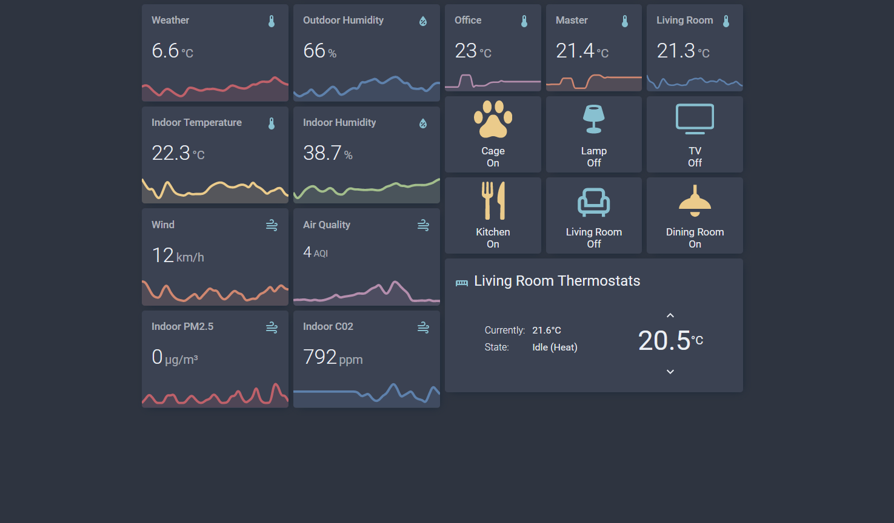

<!-- PROJECT SHIELDS -->
<div align="center">

[](https://github.com/hacs/integration) [](https://github.com/coltondick/nordic-theme-main/commits/main) [](https://github.com/coltondick/nordic-theme-main/blob/main/LICENSE) [](https://github.com/coltondick/nordic-theme-main/stargazers) [](https://www.linkedin.com/in/coltdi)

</div>

<!-- PROJECT LOGO -->
<br />
<div align="center">

  <h1 align="center">Home Assistant Nordic Theme</h1>

  <p align="center">
     A simple Nordic theme based on the <a href="https://www.nordtheme.com/docs/colors-and-palettes">Nord color pallette</a>.
    <br />
  </p>
</div>

<!-- TABLE OF CONTENTS -->
<details>
  <summary>Table of Contents</summary>
  <ol>
    <li>
      <a href="#screenshot">Screenshot</a>
    </li>
    <li>
      <a href="#home-assistant-setup">Home Assistant Setup</a>
    </li>
    <li><a href="#hacs-installation">HACS installation</a></li>
    <li><a href="#enable-theme">Enable theme</a></li>
    <li><a href="#color-options">Color Options</a></li>
    <li><a href="#color-reference">Color Reference</a></li>
    <li><a href="#credit">Credit</a></li>
  </ol>
</details>

## Screenshot



### Home Assistant Setup

Make sure that under the **configuration.yaml** file you have the following:

```
frontend:
  themes: !include_dir_merge_named themes
```

### HACS installation

1. Go into the Community Store (HACS)
2. Search for Nordic theme
3. Open the theme
4. Press Install
5. (optional) Restart Home Assistant

### Enable theme

1. Open your Home Assistant **Profile**
2. Under, **Themes**, select the new Nordic theme

### Color Options

Any of the colors can be used anywhere a color parameter is accept in Home Assistant's configuration.

```yaml
## Example graph card using color from the themes variables.

type: custom:mini-graph-card
entities:
  - sensor.temperature
name: Weather
line_color: var(--aurora-red) # Replace var(--aurora-red) with any of the color variables listed below. ex. var(--snow-dark)
line_width: 8
font_size: 100
hours_to_show: 168
points_per_hour: 0.25
```

### Color Reference

| Color Variable    | Color Code | Color                                          |
| ----------------- | ---------- | ---------------------------------------------- |
| aurora-red        | #bf616a    |  |
| aurora-blue       | #5e81ac    |  |
| aurora-green      | #a3be8c    |  |
| aurora-yellow     | #ebcb8b    |  |
| aurora-orange     | #d08770    |  |
| aurora-pink       | #b48ead    |  |
| frost-green       | #8fbcbb    |  |
| frost-sky-blue    | #88c0d0    |  |
| frost-cadet-blue  | #81a1c1    |  |
| frost-steel-blue  | #5e81ac    |  |
| snow-dark         | #d8dee9    |  |
| snow-medium       | #e5e9f0    |  |
| snow-light        | #eceff4    |  |
| polar-dark-gray   | #2e3440    |  |
| polar-bright-gray | #3B4252    |  |
| polar-river-gray  | #434c5e    |  |
| polar-light-gray  | #4c566a    |  |